# Software Design Document (SDD)

## PRISM: Platform for Real-time Insights & Social Monitoring

|||
|------------------|--------------------------|
| Document Version | 1.0                      |
| Status           | Draft                    |
| Date             | 2026-02-22               |

---

## Table of Contents

1. [Introduction](#1-introduction)
2. [High-Level Design (HLD)](#2-high-level-design-hld)
3. [Low-Level Design (LLD)](#3-low-level-design-lld)
4. [Database Design](#4-database-design)
5. [Detailed Flows](#5-detailed-flows)
6. [Configuration Design](#6-configuration-design)
7. [Deployment Design](#7-deployment-design)

---

## 1. Introduction

### 1.1 Purpose

This document describes the backend software design of **PRISM (Platform for Real-time Insights & Social Monitoring)**. It covers the high-level architecture, low-level module design, database schemas, data flows, configuration management, and deployment strategy. This document is intended for developers, architects, and technical stakeholders involved in building, maintaining, or extending the system.

### 1.2 Scope

This SDD covers:
- The architecture of the PRISM backend (Node.js/Express application)
- Design of all existing modules (ingestion, classification, worker pool, APIs)
- Design of planned modules (translation, NOT words filter, SharePoint publishing, adverse event notifications)
- Azure Cosmos DB schema design for all containers
- End-to-end data flows with Mermaid diagrams
- Configuration file formats and environment variable reference
- Docker and Azure App Service deployment architecture

### 1.3 Design Goals & Principles

| Principle | Application |
|-----------|-------------|
| **Async-First** | Webhook responses return immediately; all processing occurs asynchronously via queues and worker pools |
| **Fault Isolation** | Classification runs in child processes; a crash in one worker does not affect the main process or other workers |
| **Config-Driven** | Brand rules, RSS feeds, blocklists, and model parameters are externalized to config files |
| **Graceful Degradation** | If the relevancy model fails to load, the system continues with brand-only classification; if a feed fails, others continue |
| **Dedup-by-Design** | Both data sources have deduplication built into the ingestion path, using content/URL hashing |
| **Minimal Dependencies** | The system uses a single database (Cosmos DB) and runs as a single deployable unit |

---

## 2. High-Level Design (HLD)

### 2.1 System Architecture Overview

The PRISM backend follows a pipeline architecture with four stages: **Ingestion → Classification → Storage → Publishing**. Each stage is decoupled through in-memory queues and asynchronous callbacks.

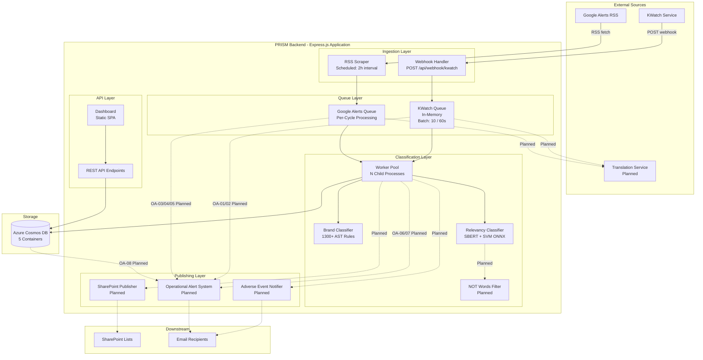

### 2.2 Technology Stack

| Layer | Technology | Version | Purpose |
|-------|-----------|---------|---------|
| Runtime | Node.js | >= 18 | Server-side JavaScript runtime |
| Framework | Express.js | 4.22.1 | HTTP server and routing |
| Database | Azure Cosmos DB | SDK 4.9.0 | NoSQL document storage |
| ML Embeddings | HuggingFace Transformers.js | 3.8.1 | SBERT sentence embeddings |
| ML Inference | ONNX Runtime (Node) | 1.21.0 | SVM model inference |
| RSS Parsing | rss-parser | 3.13.0 | RSS/Atom feed parsing |
| Content Extraction | @mozilla/readability + jsdom | 0.6.0 / 28.1.0 | Article text extraction |
| Language Detection | franc + langdetect | 6.2.0 / 0.2.1 | Language identification |
| Hashing | Node.js crypto (MD5) | Built-in | Content and URL deduplication |
| Testing | Jest + Supertest | 30.2.0 / 7.2.2 | Unit and integration testing |
| Containerization | Docker | node:20-bookworm | Production deployment |
| Translation (Planned) | Argos Translate | - | Neural machine translation |
| SharePoint (Planned) | Microsoft Graph API | v1.0 | SharePoint list operations |

### 2.3 Data Flow Overview

The following diagram shows the high-level data flow from source to final storage, covering both KWatch and Google Alerts pipelines:

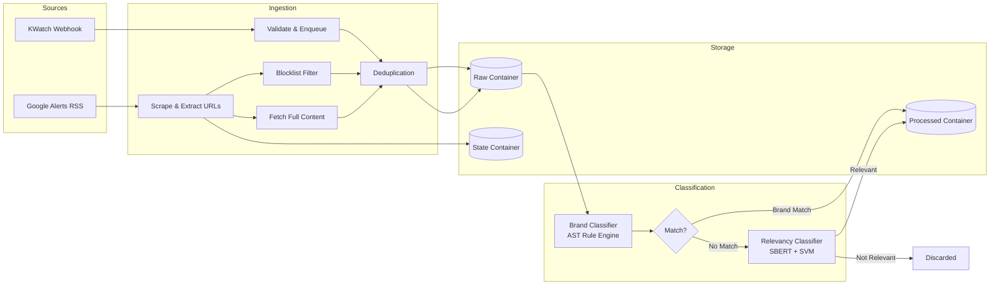

### 2.4 Deployment Architecture

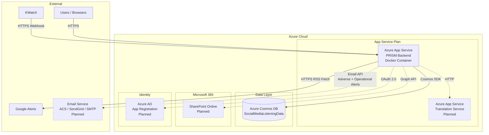

**Deployment Methods:**

| Method | Environment | Configuration |
|--------|-------------|---------------|
| Docker Container | Linux App Service | `Dockerfile` - Multi-stage build with model pre-download |
| IIS/iisnode | Windows App Service | `web.config` - Maps requests to Node.js via iisnode |
| Direct | Local Development | `npm run dev` - nodemon with auto-reload |

---

## 3. Low-Level Design (LLD)

### 3.1 Module Decomposition

The backend is organized into five functional layers, each consisting of one or more modules:

| Layer | Module | File(s) | Responsibility |
|-------|--------|---------|----------------|
| **Entry Point** | Server | `server.js` | Application bootstrap, middleware setup, scheduler initialization |
| **Ingestion** | Webhook Handler | `routes/webhook.js` | KWatch payload validation and queuing |
| | KWatch Queue | `services/kwatchQueue.js` | In-memory queue, batch processing, dedup, DB insertion |
| | Google Alerts Scraper | `services/googleAlertsService.js` | RSS scraping, URL extraction, content fetch, state management |
| **Classification** | Brand Classifier | `services/brandClassifier.js` | CSV parsing, AST compilation, rule-based matching |
| | Query Parser | `utils/parser.js` | Tokenization, AST parsing, rule evaluation |
| | Relevancy Classifier | `utils/relevancyClassifier.js` | SBERT embedding, SVM inference |
| | Classification Service | `services/classificationService.js` | Two-stage orchestration with fallback logic |
| | Worker Pool | `services/classificationWorkerPool.js` | Child process management, IPC, round-robin |
| | Worker Process | `workers/classificationWorkerProcess.js` | Classifier initialization and job execution |
| **API** | Routes | `routes/*.js` | REST endpoint handlers |
| | Dashboard | `public/index.html` | Static SPA frontend |
| **Configuration** | Database | `config/database.js` | Cosmos DB client singleton |
| | Brand Queries | `config/BrandQueries.csv` | Rule definitions |
| | RSS Feeds | `config/alerts_rss_feeds.json` | Feed URL registry |
| | Blocklist | `config/alerts_not_websites.json` | Domain exclusions |
| | Model Config | `models/model_config.json` | ML hyperparameters |

---

### 3.2 KWatch Ingestion Module

**Files:** `routes/webhook.js`, `services/kwatchQueue.js`

**Responsibilities:**
- Receive and validate webhook payloads
- Generate content-based document IDs (MD5)
- Manage the in-memory queue with batch draining
- Handle deduplication with duplicate recovery
- Insert raw documents to Cosmos DB
- Submit classification jobs to the worker pool
- Handle classification results and insert processed documents

**Key Design Decisions:**

| Decision | Rationale |
|----------|-----------|
| Immediate HTTP 200 response with `setImmediate()` scheduling | Prevents webhook timeout; KWatch expects fast acknowledgment |
| In-memory queue (not persistent) | Simplicity; acceptable data loss risk for a monitoring system since sources can be re-scraped |
| MD5 for content hashing | Fast, deterministic, collision-acceptable for dedup (not cryptographic use) |
| Duplicate recovery with new ID | Preserves all data; marks duplicates for downstream awareness |

**Result Handling:** When the worker pool returns a classification result for a KWatch item:
- If `matched = true`: Build a processed document combining all original fields with classification fields (topic, subTopic, queryName, internalId, relevantByModel, isDuplicate), and insert into KWatchProcessedData.
- If `matched = false`: The item is not stored in the processed container (it remains in raw only).

---

### 3.3 Google Alerts Scraper Module

**File:** `services/googleAlertsService.js`

**Responsibilities:**
- Schedule and execute RSS feed scraping cycles
- Track per-feed state for incremental scraping
- Extract real article URLs from Google redirect links
- Fetch full article text via Mozilla Readability
- Apply website blocklist filtering
- Deduplicate articles by URL hash
- Insert raw documents and submit classification jobs
- Handle classification results and insert processed documents

**Key Design Decisions:**

| Decision | Rationale |
|----------|-----------|
| 2-hour scrape interval | Balances freshness vs. Google rate limits; configurable |
| Concurrency of 10 feeds per batch | Limits concurrent HTTP connections to avoid throttling |
| Topmost-link-hash state tracking | Efficient O(1) comparison to detect new entries without storing all seen URLs |
| Readability with JSDOM | Accurate content extraction without browser dependency; handles most article layouts |
| 10s fetch timeout per article | Prevents slow sites from stalling the pipeline |
| 100-char minimum for full content | Filters out extraction failures that return only navigation text or boilerplate |

**URL Extraction Design:**
Google Alerts RSS entries use redirect URLs of the form:
```
https://www.google.com/url?rct=j&sa=t&url=<encoded_actual_url>&ct=ga&...
```
The system uses the `URL` constructor to parse the redirect URL and extracts the `url` query parameter, which contains the actual article URL.

**Result Handling:** When the worker pool returns a classification result for a Google Alerts item:
- If `matched = true`: Build a processed document combining all raw fields with classification fields plus a `classifiedAt` timestamp, and insert into GoogleAlertsProcessedData.
- If `matched = false`: The item remains in raw only.

---

### 3.4 Brand Classifier Module

**Files:** `services/brandClassifier.js`, `utils/parser.js`

**Responsibilities:**
- Parse the BrandQueries CSV file at initialization
- Compile each query string into an AST
- Evaluate ASTs against normalized/tokenized text
- Handle special cases (Portuguese language override)
- Return the first matching classification

#### 3.4.1 Query Language Grammar (BNF)

```
<expression>  ::= <or-expr>
<or-expr>     ::= <and-expr> ( "OR" <and-expr> )*
<and-expr>    ::= <not-expr> ( "AND"? <not-expr> )*
<not-expr>    ::= "NOT" <primary> | <primary>
<primary>     ::= "(" <expression> ")"
                 | <near-expr>
                 | <term>
<near-expr>   ::= <term> "NEAR/" <integer> <term>
<term>        ::= <quoted-phrase> | <wildcard> | <mention> | <hashtag> | <word>
<quoted-phrase> ::= '"' <word> ( ' ' <word> )* '"'
<wildcard>    ::= <word> "*"
<mention>     ::= "@" <word>
<hashtag>     ::= "#" <word>
<word>        ::= [a-z0-9@#]+
```

#### 3.4.2 AST Node Types

| Node Type | Fields | Description |
|-----------|--------|-------------|
| `AND` | `children[]` | All children must match |
| `OR` | `children[]` | At least one child must match |
| `NOT` | `child` | Child must not match (negation) |
| `NEAR` | `left`, `right`, `distance` | Both terms within N tokens |
| `TERM` | `value` | Single word token match |
| `PHRASE` | `words[]` | Exact sequence of words |
| `WILDCARD` | `prefix` | Matches tokens starting with prefix |

#### 3.4.3 Rule Evaluation Algorithm

1. **Text Normalization:**
   - Convert to lowercase
   - NFD Unicode decomposition (remove diacritics: é → e, ñ → n)
   - Replace non-alphanumeric characters (except @ and #) with spaces
   - Collapse multiple spaces

2. **Tokenization:** Split normalized text into an array of tokens.

3. **NOT-First Evaluation:**
   - Extract all NOT nodes from the AST
   - If any NOT node's child matches the tokens, the entire rule fails immediately
   - This short-circuits early for rules with exclusion clauses

4. **Positive Evaluation:**
   - Evaluate the remaining positive clauses (AND, OR, NEAR, TERM, PHRASE, WILDCARD)
   - For NEAR/n: find positions of both terms in the token array, check if any pair is within n positions *(Updated Requirement: Consider equivalent to AND)*
   - For WILDCARD: check if any token starts with the prefix
   - For PHRASE: check if the exact sequence of words appears consecutively

5. **Final Decision:**
   - If any NOT matched: reject
   - If positive clauses exist and matched: accept
   - If only NOT clauses (no positive): accept (negation-only queries match when exclusion terms are absent)

---

### 3.5 Relevancy Classifier Module

**File:** `utils/relevancyClassifier.js`

**Responsibilities:**
- Load the SBERT embedding model and ONNX SVM model at initialization
- Generate 384-dimensional embeddings for input text
- Run SVM inference to produce relevancy probability
- Apply threshold-based decision with Stryker-specific adjustment

#### 3.5.1 Embedding Pipeline

1. Input text is passed to the SBERT model (`Xenova/all-MiniLM-L6-v2`)
2. The model performs tokenization, encoding, and mean pooling internally
3. Output: a normalized 384-dimensional Float32Array embedding vector

#### 3.5.2 SVM Inference

1. The embedding vector is reshaped to a `[1, 384]` ONNX tensor
2. The tensor is passed to the SVM model via `onnxruntime-node`
3. Output: probability array `[P(Not Related), P(Mention)]`
4. The `P(Mention)` value (index 1) is used as the relevancy score

#### 3.5.3 Threshold Strategy

| Condition | Threshold | Rationale |
|-----------|-----------|-----------|
| Text contains "stryker" | 0.55 | Higher threshold to filter out tangential brand-name mentions (sports, pop culture) |
| All other text | 0.40 | Lower threshold to maximize recall for non-brand-specific content |

The dual-threshold design is driven by the observation that texts mentioning "Stryker" by name often have higher base model scores even when not medically relevant (e.g., sports, entertainment).

---

### 3.6 Classification Orchestration Module

**File:** `services/classificationService.js`

**Responsibilities:**
- Coordinate the two-stage classification pipeline
- Implement the brand-first, relevancy-fallback logic
- Extract subTopic from query strings for relevancy-only matches
- Provide a unified classification result structure

**Orchestration Logic:**

| Stage | Condition | Action |
|-------|-----------|--------|
| 1 | Text is empty | Return `{ matched: false }` |
| 2 | Brand rule matches | Run relevancy model for annotation → Return `{ matched: true, method: 'BrandQuery' }` |
| 3 | No brand match, relevancy says relevant | Extract subTopic from query → Return `{ matched: true, method: 'RelevancyClassification' }` |
| 4 | No brand match, relevancy says not relevant | Return `{ matched: false }` |

**SubTopic Extraction:** For relevancy-only matches, the subTopic is derived from the item's `query` field by taking all characters before the first period (`.`). For example, `"Gamma3.Medical"` → `"Gamma3"`. If no period exists, the entire query is used.

---

### 3.7 Worker Pool Module

**Files:** `services/classificationWorkerPool.js`, `workers/classificationWorkerProcess.js`

**Responsibilities:**
- Fork and manage N child processes
- Load classifiers within each worker process
- Distribute jobs via round-robin IPC
- Track per-job callbacks and metrics
- Handle worker crashes with automatic respawn

#### 3.7.1 IPC Protocol

**Parent → Worker Messages:**

| Type | Fields | Description |
|------|--------|-------------|
| `classify` | `jobId`, `data` | Submit a classification job |

**Worker → Parent Messages:**

| Type | Fields | Description |
|------|--------|-------------|
| `ready` | - | Worker initialization complete |
| `result` | `jobId`, `success`, `result`, `error` | Classification result or error |

#### 3.7.2 Job Distribution (Round-Robin)

The pool maintains a `nextWorkerIndex` counter. When a job is submitted:
1. Starting from `nextWorkerIndex`, scan workers for one that is `ready` and not `busy`.
2. If found: Mark as busy, send the job via IPC, store the callback in a pending jobs map.
3. Advance `nextWorkerIndex = (selectedIndex + 1) % workerCount`.
4. If no available worker: Add the job to an internal queue (bounded by max queue size).

#### 3.7.3 Crash Recovery

When a worker process exits with a non-zero code:
1. Increment `workerCrashes` metric.
2. Fail any pending job for that worker with an error callback.
3. Fork a new child process in the same slot.
4. The new worker loads classifiers and sends `ready` when initialized.
5. The pool resumes distributing jobs to the replacement worker.

Workers that exit with code 0 (graceful) during shutdown are not restarted.

#### 3.7.4 Backpressure Handling

| Condition | Behavior |
|-----------|----------|
| All workers busy, queue < max | Job added to internal queue |
| All workers busy, queue = max | `submitJob()` returns `null`; caller decides whether to log and skip or retry |
| Worker becomes free | Dequeue next job from internal queue and send to worker |

---

### 3.8 API Layer Design

**File:** `routes/index.js` (aggregator), `routes/*.js` (individual route files)

**Route Registration:**

| Route File | Prefix | Endpoints |
|------------|--------|-----------|
| `webhook.js` | `/api/webhook` | POST `/kwatch` |
| `kwatch.js` | `/api/kwatch` | GET `/`, GET `/processed` |
| `googleAlerts.js` | `/api/google-alerts` | GET `/`, GET `/processed`, GET `/state`, POST `/trigger` |
| `classify.js` | `/api/classify` | POST `/`, GET `/status` |
| `health.js` | `/api/health` | GET `/` |

**Common Patterns:**
- All data retrieval endpoints support `page` and `limit` query parameters
- Pagination is implemented via Cosmos DB `OFFSET` and `LIMIT` SQL queries
- Total counts are retrieved via separate `COUNT` queries
- Error responses follow a consistent `{ error: string }` format

---

### 3.9 Dashboard Module

**File:** `public/index.html`

**Design:** Single HTML file with embedded CSS and JavaScript (no build tooling). Dark-themed responsive layout.

**Architecture:**
- Fetches data from `/api/kwatch` and `/api/kwatch/processed` endpoints
- User can toggle between Raw and Processed views via a keyboard shortcut (Ctrl+K)
- Auto-refreshes data every 2 minutes using `setInterval`
- Pagination handled client-side by updating the `page` query parameter

---

### 3.10 Remaining Planned Modules

#### 3.10.1 Translation Service Integration

**Integration Point:** Between ingestion and classification.

**Design Concept:**
- After an item is ingested (raw document created), detect its language using the existing `franc` or `langdetect` library.
- If the language is non-English and one of the 23 supported languages, send an HTTP request to the Translation Service.
- Store the English translation in a `translatedContent` field on the raw document.
- When submitting to the worker pool for classification, provide both the original text and the translated text.
- The brand classifier evaluates both texts (original may match multilingual rules; translation enables English-only rules to match).
- The relevancy classifier runs on the English translation for better accuracy (the SBERT model is English-trained).

**Cold Start Architecture Options (Under Evaluation):**

| Option | Description | Trade-off |
|--------|-------------|-----------|
| Always-on warm pool | All 7 high-freq models pre-loaded; 3 conditional slots | Higher memory cost, lowest latency |
| Queue-based async | Translation requests queued; items processed when model ready | Adds latency, decoupled from pipeline |
| Health-check gating | Caller waits for model readiness with timeout | Block-and-wait, simpler logic |
| Lazy init with fallback | Load on demand; timeout to untranslated text | Graceful degradation, some items miss translation |

#### 3.10.2 NOT Words Filter Module

**Integration Point:** After relevancy classification, before processed document insertion.

**Design Concept:**
- Load a config file (JSON) at startup that maps keyword/feed names to arrays of exclusion words.
- After the classification service returns `method: 'RelevancyClassification'`, look up the item's `query`/`feedName` in the config.
- Perform case-insensitive substring search for each NOT word in the item's text.
- If any NOT word is found: override the classification result to `matched: false` (item not stored in processed container).

#### 3.10.3 SharePoint Publisher Module

**Integration Point:** After processed document insertion.

**Design Concept:**
- Register an Azure AD application with `Sites.ReadWrite.All` permission.
- On successful classification result + processed document insertion, map the document to the unified SharePoint schema.
- Acquire an OAuth 2.0 access token using client credentials flow (tenant ID, client ID, client secret).
- POST the unified document as a new list item to the configured SharePoint list using the Microsoft Graph API.
- On success: Update the processed document in Cosmos DB with `publishedToSharePoint: true` and `publishedAt`.
- On failure: Log the error. The document retains `publishedToSharePoint: false` and can be retried by a scheduled sweep.

**API Call Pattern:**
```
POST https://graph.microsoft.com/v1.0/sites/{site-id}/lists/{list-id}/items
Authorization: Bearer {access-token}
Content-Type: application/json

{
  "fields": {
    "id": "...",
    "platform": "...",
    "query": "...",
    ...
  }
}
```

#### 3.10.4 Adverse Event Notifier Module

**Integration Point:** After classification, when topic matches death-related criteria.

**Design Concept:**
- After a classification result is obtained, check if the topic/subTopic indicates a death-related adverse event.
- If the trigger condition is met, construct a notification payload containing the item details, classification, and source link.
- Send an email to configured recipients via the chosen email delivery mechanism (TBD: SMTP, Azure Communication Services, or SendGrid).
- Track notification status to prevent duplicate alerts for the same item.

---

#### 3.10.5 Operational Alert Email System

**Integration Point:** Monitoring hooks distributed across `services/kwatchQueue.js`, `services/googleAlertsService.js`, `services/classificationWorkerPool.js`, and `config/database.js`.

**Design Concept:**

A lightweight `OperationalAlertService` module fires outbound emails when internal pipeline health metrics cross configured thresholds. Unlike the adverse event notifier (content-driven), this module is entirely infrastructure-driven and operates independently of classification results.

**Trigger Points and Detection Strategy:**

| Trigger | Detection Location | Detection Method |
|---------|-------------------|------------------|
| Queue nearing full (≥ 80%) | `kwatchQueue.js` — item enqueue path | Compare `queue.length` against `MAX_CLASSIFICATION_QUEUE_SIZE * 0.8` on each enqueue |
| Queue full — item dropped | `kwatchQueue.js` — item enqueue path | `submitJob()` returns `null`; alert immediately |
| High feed failure rate (≥ 10%) | `googleAlertsService.js` — end of scrape cycle | Compare `failedFeeds / totalFeeds` after cycle completion |
| Complete scrape cycle failure | `googleAlertsService.js` — end of scrape cycle | `processedFeeds === 0` after a cycle that had configured feeds |
| Scrape cycle timeout | `googleAlertsService.js` — cycle timer | `setTimeout` watchdog set to 2× expected max duration; fires if cycle has not completed |
| Worker crash storm (≥ 3 in 5 min) | `classificationWorkerPool.js` — `exit` handler | Maintain a rolling timestamp array of crashes; alert when window count ≥ threshold |
| All workers unavailable (≥ 30 s) | `classificationWorkerPool.js` — queue drain loop | Track last time a ready worker was found; fire if gap exceeds threshold |
| Repeated Cosmos DB failures (≥ 5) | `config/database.js` or call sites | Maintain a per-container consecutive-failure counter; reset on success |

**Alert Deduplication:**

Each trigger maintains a `lastAlertTime` timestamp. Before sending, the service checks whether `now - lastAlertTime < ALERT_COOLDOWN_MS` (default: 30 minutes, configurable). If within cooldown, the alert is suppressed and only logged locally. The cooldown resets when the condition clears (e.g., queue drops below the threshold) and re-triggers.

**Email Payload Structure:**
```json
{
  "triggerId": "OA-01",
  "title": "KWatch queue nearing capacity",
  "severity": "warning",
  "detectedAt": "<ISO 8601 timestamp>",
  "environment": "<NODE_ENV>",
  "details": {
    "currentQueueSize": 820,
    "maxQueueSize": 1000,
    "utilizationPercent": 82
  },
  "remediation": "Increase MAX_CLASSIFICATION_QUEUE_SIZE, add classification workers, or upgrade App Service plan."
}
```

**Shared Infrastructure with Adverse Event Notifier:**

Both modules use the same underlying email delivery client (SMTP / Azure Communication Services / SendGrid — TBD). A shared `EmailService` singleton handles token acquisition, connection pooling, and send retries, so delivery configuration (credentials, `from` address, retry policy) is maintained in one place.

**Configuration (Environment Variables):**

| Variable | Description | Default |
|----------|-------------|---------|
| `ALERT_EMAIL_RECIPIENTS` | Comma-separated list of operator email addresses | — |
| `ALERT_COOLDOWN_MS` | Minimum ms between repeated alerts for the same trigger | `1800000` (30 min) |
| `ALERT_QUEUE_THRESHOLD_PCT` | Queue utilization % that triggers OA-01 | `80` |
| `ALERT_FEED_FAILURE_PCT` | Feed failure % per cycle that triggers OA-03 | `10` |
| `ALERT_WORKER_CRASH_WINDOW_MS` | Rolling window for crash-storm detection (OA-06) | `300000` (5 min) |
| `ALERT_WORKER_CRASH_COUNT` | Crash count within window to trigger OA-06 | `3` |
| `ALERT_DB_FAILURE_COUNT` | Consecutive DB failures to trigger OA-08 | `5` |

---

## 4. Database Design

### 4.1 Database Overview

**Database Engine:** Azure Cosmos DB (NoSQL / Document API)

**Database Name:** `SocialMediaListeningData` (configurable via `COSMOS_KWATCH_DATABASE` env var)

**Container Summary:**

| Container | Partition Key | Document Count Profile | Purpose |
|-----------|--------------|----------------------|---------|
| KWatchRawData | `/platform` + `/id` (hierarchical) | Growing (all incoming items) | Raw webhook payloads |
| KWatchProcessedData | `/platform` + `/id` (hierarchical) | Growing (classified items only) | Classified KWatch items |
| GoogleAlertsRawData | `/id` | Growing (all scraped articles) | Raw scraped articles |
| GoogleAlertsProcessedData | `/id` | Growing (classified items only) | Classified Google Alerts articles |
| GoogleAlertsState | `/id` | Fixed (one per feed, ~50-100 docs) | Per-feed scrape state tracking |

---

### 4.2 Container: KWatchRawData

**Partition Key:** `/platform` (hierarchical with `/id`)
**Throughput:** Shared (auto-scale recommended)

| Field | Type | Required | Source | Description |
|-------|------|----------|--------|-------------|
| `id` | String | Yes | Generated | MD5 hash of `content` (primary dedup key). For duplicate-recovered items, this is `MD5(platform + datetime + author + timestamp)` - a unique composite key to avoid collisions |
| `platform` | String | Yes | Webhook payload | Source social media platform identifier (e.g., `"twitter"`, `"reddit"`, `"linkedin"`, `"facebook"`, `"instagram"`) |
| `query` | String | Yes | Webhook payload | The search keyword or topic that triggered this mention in KWatch |
| `datetime` | String (ISO 8601) | Yes | Webhook payload | Publication timestamp of the original social media post in ISO 8601 format |
| `link` | String (URL) | Yes | Webhook payload | Direct URL to the original post on the source platform |
| `author` | String | Yes | Webhook payload | Username or account identifier of the post author |
| `title` | String | Yes | Webhook payload | Post title or headline. Defaults to empty string `""` if not provided by KWatch |
| `content` | String | Yes | Webhook payload | Full text body of the social media post |
| `sentiment` | String | Yes | Webhook payload | Pre-classified sentiment value from KWatch. Defaults to `"neutral"` if not provided |
| `receivedAt` | String (ISO 8601) | Yes | Server-generated | Server-side timestamp recording when the webhook was received by PRISM |
| `isDuplicate` | Boolean | Yes | System-generated | `false` for first-time items. `true` for items that had an ID collision (duplicate content) and were re-inserted with a new unique ID |

---

### 4.3 Container: KWatchProcessedData

**Partition Key:** `/platform` (hierarchical with `/id`)
**Throughput:** Shared (auto-scale recommended)

This container stores only items that were successfully classified (matched by brand rules or relevancy model). Items that matched neither are not stored here.

| Field | Type | Required | Source | Description |
|-------|------|----------|--------|-------------|
| `id` | String | Yes | Copied from raw | Same document ID as the corresponding raw item |
| `platform` | String | Yes | Copied from raw | Source platform identifier |
| `query` | String | Yes | Copied from raw | Triggering search keyword |
| `datetime` | String (ISO 8601) | Yes | Copied from raw | Original post publication timestamp |
| `link` | String (URL) | Yes | Copied from raw | URL to the source post |
| `author` | String | Yes | Copied from raw | Post author |
| `title` | String | Yes | Copied from raw | Post title |
| `content` | String | Yes | Copied from raw | Post full text |
| `sentiment` | String | Yes | Copied from raw | Sentiment value |
| `receivedAt` | String (ISO 8601) | Yes | Copied from raw | Original reception timestamp |
| `topic` | String | Yes | Classification | Primary classification category assigned by the brand classifier (e.g., `"Ankle Joint"`, `"Competitors"`) or `"General-RelevancyClassification"` for relevancy-only matches |
| `subTopic` | String | Yes | Classification | Secondary classification category (e.g., `"GRAVITY Synchfix"`, `"Depuy-Synthes"`) or extracted from query field for relevancy-only matches |
| `queryName` | String | Yes | Classification | Language of the matching brand query rule, or `"RelevancyClassification"` for relevancy fallback matches |
| `internalId` | String | Yes | Classification | UUID of the matching brand query rule from `BrandQueries.csv`, or the fixed placeholder `"74747474747474747474747474747474"` for relevancy-only matches |
| `relevantByModel` | Boolean | Yes | ML Model | Whether the SBERT+SVM relevancy model considers this item relevant. Set regardless of which classification method was authoritative |
| `isDuplicate` | Boolean | Yes | Copied from raw | Whether this was a duplicate-recovered item |
| `publishedToSharePoint` | Boolean | No | Planned | Whether the item was successfully published to SharePoint. Default: `false` |
| `publishedAt` | String (ISO 8601) / null | No | Planned | Timestamp of successful SharePoint publication. `null` if not yet published |

---

### 4.4 Container: GoogleAlertsRawData

**Partition Key:** `/id`
**Throughput:** Shared (auto-scale recommended)

| Field | Type | Required | Source | Description |
|-------|------|----------|--------|-------------|
| `id` | String | Yes | Generated | MD5 hash of `extractedUrl` - ensures one document per unique article URL across all feeds |
| `platform` | String | Yes | Constant | Always `"google-alerts"` - identifies the data source |
| `feedName` | String | Yes | Config | Name of the Google Alerts RSS feed from `alerts_rss_feeds.json` (e.g., `"ADAPT 2.1 for Gamma3 Stryker"`) |
| `keyword` | String | Yes | Config | Same as `feedName` - preserves the alert keyword for reference |
| `query` | String | Yes | Derived | Same as `keyword` - used for classification compatibility (classification service expects a `query` field) |
| `googleLink` | String (URL) | Yes | RSS Entry | Original Google Alerts redirect URL from the RSS feed entry (format: `https://www.google.com/url?...`) |
| `extractedUrl` | String (URL) | Yes | Extracted | Actual article URL extracted from the Google redirect link's `url` query parameter |
| `title` | String | Yes | RSS Entry | Article title from the RSS feed, with HTML tags stripped and entities decoded |
| `contentSnippet` | String | Yes | RSS Entry | Article summary/snippet from the RSS feed description, with HTML tags stripped and entities decoded |
| `fullContent` | String / null | No | Fetched | Full article text extracted via Mozilla Readability from the actual article webpage. `null` if extraction failed or was not attempted |
| `contentSource` | String | Yes | System | Indicates which content was used for classification: `"full"` if `fullContent` was available, `"snippet"` if only `contentSnippet` was used |
| `content` | String | Yes | Derived | The actual text content used for classification - equals `fullContent` if available, otherwise `contentSnippet` |
| `publishedAt` | String (ISO 8601) | Yes | RSS Entry | Article publication date from the RSS feed entry in ISO 8601 format |
| `scrapedAt` | String (ISO 8601) | Yes | Server-generated | Timestamp recording when PRISM scraped and stored this article |

---

### 4.5 Container: GoogleAlertsProcessedData

**Partition Key:** `/id`
**Throughput:** Shared (auto-scale recommended)

This container stores only articles that were successfully classified. Articles matching neither brand rules nor the relevancy model are not stored here.

| Field | Type | Required | Source | Description |
|-------|------|----------|--------|-------------|
| `id` | String | Yes | Copied from raw | Same document ID as the corresponding raw article |
| `platform` | String | Yes | Copied from raw | Always `"google-alerts"` |
| `feedName` | String | Yes | Copied from raw | Source feed name |
| `keyword` | String | Yes | Copied from raw | Alert keyword |
| `googleLink` | String (URL) | Yes | Copied from raw | Original Google redirect URL |
| `extractedUrl` | String (URL) | Yes | Copied from raw | Actual article URL |
| `title` | String | Yes | Copied from raw | Article title |
| `contentSnippet` | String | Yes | Copied from raw | RSS feed snippet |
| `fullContent` | String / null | No | Copied from raw | Full extracted article text |
| `contentSource` | String | Yes | Copied from raw | Content source indicator (`"full"` or `"snippet"`) |
| `content` | String | Yes | Copied from raw | Text used for classification |
| `publishedAt` | String (ISO 8601) | Yes | Copied from raw | Article publication date |
| `scrapedAt` | String (ISO 8601) | Yes | Copied from raw | Scraping timestamp |
| `topic` | String | Yes | Classification | Primary classification category from brand rules or `"General-RelevancyClassification"` |
| `subTopic` | String | Yes | Classification | Secondary classification category |
| `queryName` | String | Yes | Classification | Language of the matching brand query rule, or `"RelevancyClassification"` for relevancy fallback matches |
| `internalId` | String | Yes | Classification | UUID of matching rule or fixed placeholder for relevancy matches |
| `relevantByModel` | Boolean | Yes | ML Model | ML relevancy model assessment |
| `classifiedAt` | String (ISO 8601) | Yes | Server-generated | Timestamp when classification was completed and the processed document was created |
| `publishedToSharePoint` | Boolean | No | Planned | Whether the item was published to SharePoint |
| `publishedAt_SP` | String (ISO 8601) / null | No | Planned | Timestamp of SharePoint publication (field named differently to avoid collision with RSS `publishedAt`) |

---

### 4.6 Container: GoogleAlertsState

**Partition Key:** `/id`
**Throughput:** Shared (minimal - low volume)

This container stores one document per configured RSS feed, tracking the scraping state for incremental processing.

| Field | Type | Required | Source | Description |
|-------|------|----------|--------|-------------|
| `id` | String | Yes | Generated | MD5 hash of `feedName` - ensures one state document per feed |
| `feedName` | String | Yes | Config | Human-readable name of the Google Alerts RSS feed |
| `feedUrl` | String (URL) | Yes | Config | Full URL of the RSS feed |
| `lastLinkHash` | String / null | Yes | Computed | MD5 hash of the topmost (newest) entry's link from the last successful scrape. `null` if the feed was empty |
| `lastScrapedAt` | String (ISO 8601) | Yes | Server-generated | Timestamp of the last scrape cycle for this feed |
| `entryCount` | Integer | Yes | RSS Feed | Total number of entries present in the feed at the time of last scrape |

---

### 4.7 Unified SharePoint Document Schema (Planned)

This is not a Cosmos DB container but rather the schema of the list items published to SharePoint Online:

| SharePoint Column | Type | KWatch Source | Google Alerts Source | Description |
|-------------------|------|---------------|---------------------|-------------|
| id | String | `item.id` | `item.id` | PRISM document ID |
| platform | String | `item.platform` | `"google-alerts"` | Source platform |
| query | String | `item.query` | `item.feedName` | Triggering keyword or feed |
| datetime | String | `item.datetime` | `item.publishedAt` | Original publication time |
| link | String | `item.link` | `item.extractedUrl` | Source URL |
| author | String | `item.author` | `"N/A"` | Post author |
| title | String | `item.title` | `item.title` | Content title |
| content | String | `item.content` | `item.content` | Text body |
| sentiment | String | `item.sentiment` | `"neutral"` | Sentiment value |
| topic | String | `item.topic` | `item.topic` | Classification topic |
| subtopic | String | `item.subTopic` | `item.subTopic` | Classification subtopic |
| relevantByModel | Boolean | `item.relevantByModel` | `item.relevantByModel` | ML relevancy flag |
| isDuplicate | Boolean | `item.isDuplicate` | `false` | Duplicate flag |

---

### 4.8 Partition Key Strategy & Justification

| Container | Partition Key | Justification |
|-----------|--------------|---------------|
| KWatchRawData | `/platform` (hierarchical with `/id`) | Groups items by platform for efficient per-platform queries. Hierarchical partitioning with `/id` enables efficient point reads |
| KWatchProcessedData | `/platform` (hierarchical with `/id`) | Same rationale as raw - downstream queries often filter by platform |
| GoogleAlertsRawData | `/id` | Each article is independent; partitioning by ID distributes load evenly. Point reads by URL hash are common |
| GoogleAlertsProcessedData | `/id` | Same as raw - even distribution, efficient point reads |
| GoogleAlertsState | `/id` | Low document count (~50-100). Partitioning by ID is sufficient for this volume |

---

### 4.9 Indexing Considerations

Azure Cosmos DB automatically indexes all fields by default. The current design relies on this default behavior. Specific indexing policies that may be optimized in production:

| Optimization | Description |
|-------------|-------------|
| Exclude `content` and `fullContent` from indexing | Large text fields increase index storage and RU consumption for writes. These fields are not used in WHERE clauses |
| Include composite index on `(platform, datetime)` | Speeds up queries that filter by platform and sort by date |
| Include composite index on `(topic, subTopic)` | Speeds up classification-based queries |
| Range index on `scrapedAt` / `receivedAt` | Efficient time-range queries for operational monitoring |

---

## 5. Detailed Flows

### 5.1 KWatch End-to-End Flow

This flow traces a single KWatch webhook payload from reception through classification to final storage.

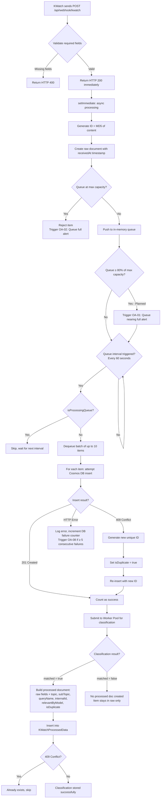

---

### 5.2 Google Alerts End-to-End Flow

This flow traces the complete RSS scraping cycle from scheduled trigger through classification.

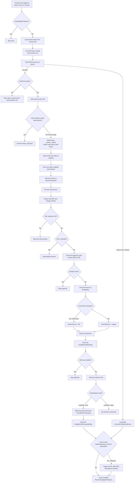

---

### 5.3 Classification Pipeline Flow

This flow details the two-stage classification decision logic executed within each worker process.

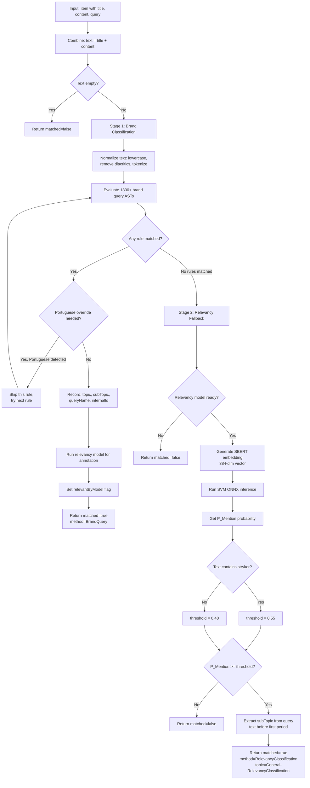

---

### 5.4 Brand Query Evaluation Flow

This flow details how a single brand query AST is evaluated against tokenized text.

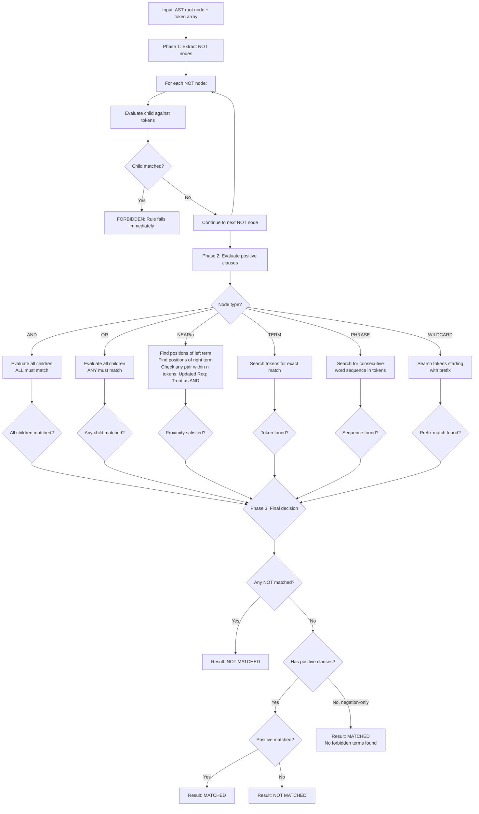

---

### 5.5 Worker Pool Lifecycle

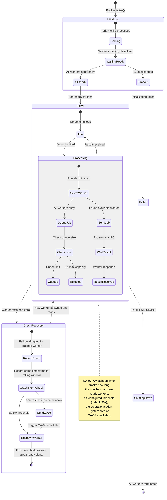

---

### 5.6 SharePoint Publishing Flow (Planned)

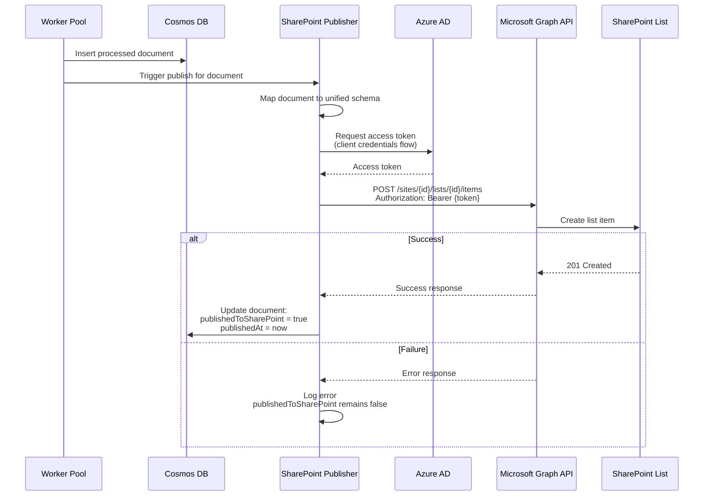

---

### 5.7 Translation Service Integration Flow (Planned)

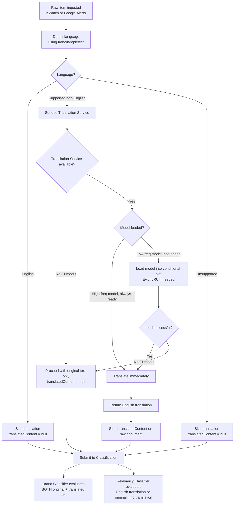

---

### 5.8 Operational Alert Email Flow (Planned)

This flow covers how a monitoring hook anywhere in the pipeline triggers an outbound operational alert email, including cooldown suppression.

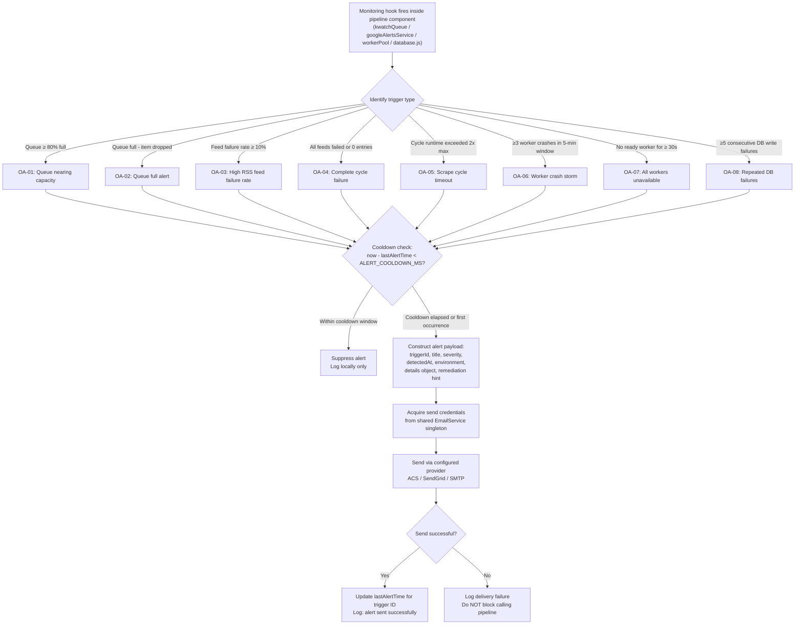

---

## 6. Configuration Design

### 6.1 BrandQueries.csv Format & Fields

**File:** `config/BrandQueries.csv`
**Format:** Standard CSV with double-quote escaping for multi-line/complex values.

| Column | Description | Example |
|--------|-------------|---------|
| Topic | Primary classification category | `Ankle Joint` |
| Sub topic | Secondary classification category | `GRAVITY Synchfix` |
| Query name | Language of query | `english` |
| Internal ID | UUID for tracking | `a1b2c3d4-e5f6-...` |
| Query | Boolean expression in custom query language | `("gravity synchfix" OR "synchfix") AND (ankle OR foot) NOT (stock OR NYSE)` |

**Loading Behavior:**
- Parsed at startup within each worker process.
- Supports multi-line quoted values (a single query can span multiple CSV rows when enclosed in quotes).
- Malformed queries are logged with their row number and skipped (do not prevent other queries from loading).
- Current count: ~1300+ rules across multiple languages (English, French, German, Italian, Portuguese, Spanish).

---

### 6.2 RSS Feed Configuration

**File:** `config/alerts_rss_feeds.json`
**Format:** JSON object mapping feed names to RSS feed URLs.

```json
{
  "ADAPT 2.1 for Gamma3 Stryker": "https://www.google.com/alerts/feeds/...",
  "Aequalis Fracture Stryker": "https://www.google.com/alerts/feeds/...",
  "Gamma3 Stryker": "https://www.google.com/alerts/feeds/...",
  ...
}
```

**Usage:**
- Keys serve as feed names, used as `feedName`/`keyword`/`query` in scraped documents.
- Values are Google Alerts RSS feed URLs.
- New feeds can be added by appending entries to this JSON file - no code changes required.
- Names typically follow the pattern: `"<Product/Topic> Stryker"`.

---

### 6.3 NOT Websites Blocklist

**File:** `config/alerts_not_websites.json`
**Format:** JSON array of domain strings.

```json
["stryker.com", "wikipedia.org"]
```

**Matching Logic:**
- Exact domain match: `stryker.com` blocks URLs with hostname `stryker.com`.
- Subdomain match: `stryker.com` also blocks `www.stryker.com`, `blog.stryker.com`, etc.
- New domains can be added to the array without code changes.

---

### 6.4 Model Configuration

**File:** `models/model_config.json`

```json
{
  "model_type": "SVM_RBF",
  "embedding_model": "Xenova/all-MiniLM-L6-v2",
  "embedding_dim": 384,
  "threshold": 0.40,
  "stryker_threshold": 0.55,
  "classes": ["Not Related", "Mention"],
  "class_labels": [0, 1],
  "metrics": {
    "auc_roc": 0.9685841238270093,
    "recall_at_threshold": 0.99,
    "precision_at_threshold": 0.9041095890410958
  }
}
```

| Field | Description |
|-------|-------------|
| `model_type` | Algorithm type for the classifier (SVM with RBF kernel) |
| `embedding_model` | HuggingFace model ID for generating text embeddings |
| `embedding_dim` | Dimensionality of the output embedding vector (384 for MiniLM-L6-v2) |
| `threshold` | Default probability threshold for classifying text as relevant |
| `stryker_threshold` | Elevated threshold applied when input text contains the word "stryker" |
| `classes` | Human-readable class names corresponding to model outputs |
| `class_labels` | Numeric class identifiers (0 = Not Related, 1 = Mention) |
| `metrics` | Model evaluation metrics from training (AUC-ROC, recall, precision at chosen threshold) |

---

### 6.5 Environment Variables Reference

| Variable | Required | Default | Description |
|----------|----------|---------|-------------|
| `COSMOS_ENDPOINT` | Yes | - | Azure Cosmos DB account endpoint URL |
| `COSMOS_KEY` | Yes | - | Azure Cosmos DB primary access key |
| `COSMOS_KWATCH_DATABASE` | Yes | - | Database name for all containers |
| `COSMOS_KWATCH_CONTAINER` | Yes | - | Container name for KWatch raw data |
| `COSMOS_KWATCH_PROCESSED_CONTAINER` | Yes | - | Container name for KWatch processed data |
| `COSMOS_GOOGLE_ALERTS_RAW_CONTAINER` | No | `GoogleAlertsRawData` | Container name for Google Alerts raw data |
| `COSMOS_GOOGLE_ALERTS_PROCESSED_CONTAINER` | No | `GoogleAlertsProcessedData` | Container name for Google Alerts processed data |
| `COSMOS_GOOGLE_ALERTS_STATE_CONTAINER` | No | `GoogleAlertsState` | Container name for feed state tracking |
| `CLASSIFICATION_WORKERS` | No | `2` | Number of child processes in the classification worker pool |
| `MAX_CLASSIFICATION_QUEUE_SIZE` | No | `1000` | Maximum number of pending jobs in the worker pool queue |
| `PORT` | No | `3000` | HTTP server listening port |
| `GOOGLE_ALERTS_SCRAPE_INTERVAL` | No | `7200000` (2 hrs) | Interval in milliseconds between RSS scrape cycles |

**Future Environment Variables (Planned):**

| Variable | Description |
|----------|-------------|
| `TRANSLATION_SERVICE_URL` | Base URL of the Translation Service |
| `SHAREPOINT_TENANT_ID` | Azure AD tenant ID for SharePoint authentication |
| `SHAREPOINT_CLIENT_ID` | Azure AD app registration client ID |
| `SHAREPOINT_CLIENT_SECRET` | Azure AD app registration client secret |
| `SHAREPOINT_SITE_ID` | SharePoint site ID for list publishing |
| `SHAREPOINT_LIST_ID` | SharePoint list ID for document publishing |

---

## 7. Deployment Design

### 7.1 Docker Multi-Stage Build

The application is containerized using a multi-stage Docker build for production deployment:

**Stage: Production Image**

| Step | Action | Purpose |
|------|--------|---------|
| 1 | `FROM node:20-bookworm` | Debian-based Node.js 20 image with native build tools |
| 2 | Install `python3`, `make`, `g++` | Required for building native ONNX Runtime bindings |
| 3 | `npm ci --only=production` | Install production dependencies only (deterministic) |
| 4 | Run `scripts/download-models.js` | Pre-download HuggingFace SBERT model into `.hf-cache/` directory |
| 5 | Copy application source code | Application files excluding dev dependencies |
| 6 | `EXPOSE 3000` | Declare container port |
| 7 | `CMD ["node", "server.js"]` | Start the application |

**Key Optimization:** The SBERT model (~90MB) is downloaded during the Docker build phase and baked into the image. This eliminates the first-request latency that would otherwise occur when the model is downloaded at runtime.

---

### 7.2 Azure App Service Configuration

**Linux (Docker): (Current)**
- Deploy the Docker image to Azure Container Registry (ACR).
- Configure the App Service to pull from ACR.
- Set environment variables in App Service Configuration > Application Settings.
- The `/api/health` endpoint serves as the health probe.

**Windows (IIS/iisnode):**
- Uses `web.config` for IIS configuration.
- iisnode module handles running Node.js behind IIS.
- Configuration: single iisnode process, max 1024 concurrent requests, auto-restart on JS/YML file changes.
- Logging enabled via iisnode devErrorsEnabled.

---

### 7.3 IIS (Windows) Configuration

The `web.config` file configures IIS to proxy requests to the Node.js application via iisnode:

| Setting | Value | Purpose |
|---------|-------|---------|
| Handler | iisnode for `server.js` | Routes all requests through Node.js |
| URL Rewrite | `/*` → `server.js` | Single entry point routing |
| Static Files | Excluded from rewrite | CSS, JS, images served directly by IIS |
| Node Processes | 1 | Single process (worker pool handles parallelism internally) |
| Max Concurrent Requests | 1024 | Connection limit per iisnode process |
| Watch Files | `*.js;*.yml` | Auto-restart on file changes |
| Logging | Enabled | iisnode error logging for diagnostics |

---

### 7.4 Scaling Considerations

| Dimension | Current Design | Scaling Path |
|-----------|---------------|-------------|
| Classification Throughput | 2 worker processes (configurable) | Increase `CLASSIFICATION_WORKERS` env var. Each additional worker adds ~500MB memory for model loading |
| Queue Capacity | 1000 item max | Increase `MAX_CLASSIFICATION_QUEUE_SIZE`. Consider persistent queue (Azure Service Bus) for guaranteed delivery |
| RSS Feed Volume | 200+ feeds, 10 concurrent | Add feeds to JSON config. Increase concurrency if feed count grows significantly |
| Database Throughput | Shared throughput (auto-scale) | Configure dedicated throughput per container for high-volume containers. Enable autoscale with max RU/s |
| Horizontal Scaling | Single instance | Requires external coordination: separate RSS feeds across instances, use distributed locking for dedup. Not currently designed for this |

---

*End of SDD Document*
